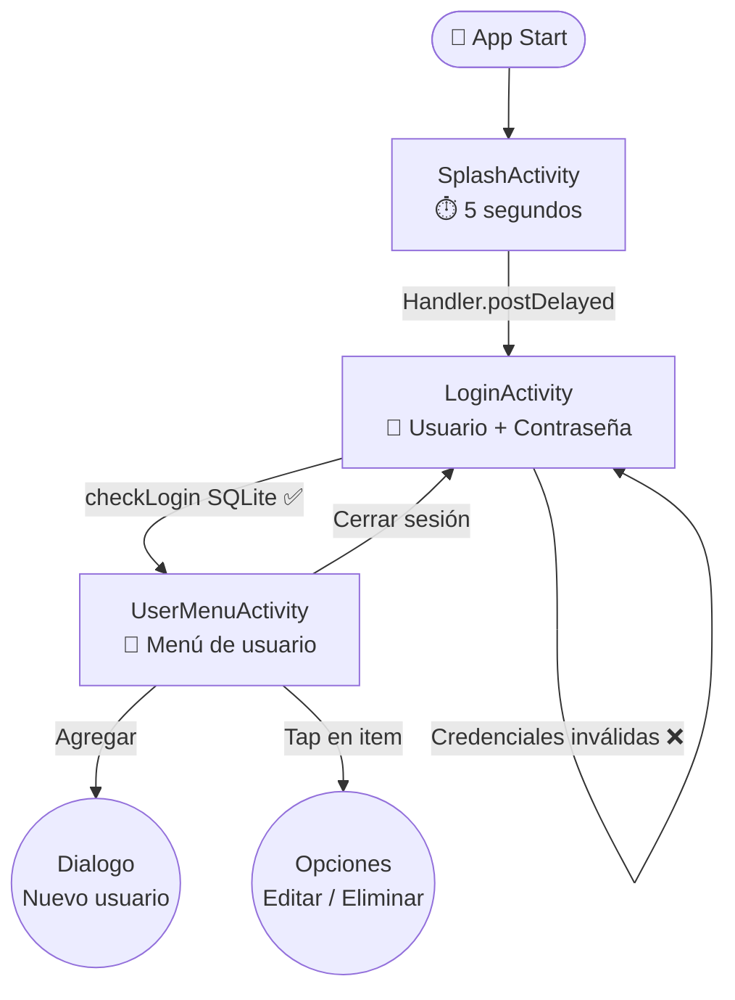
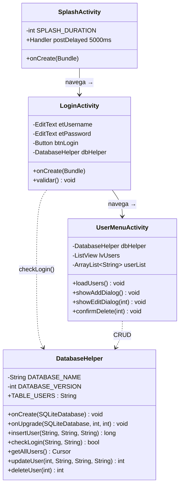
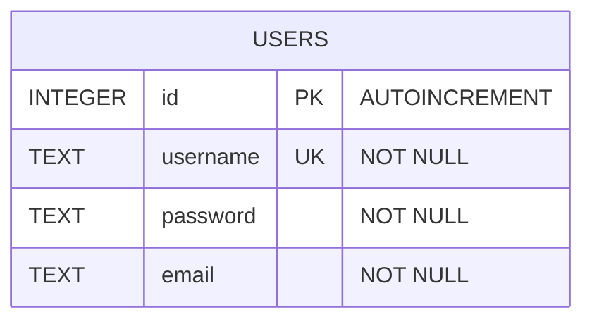
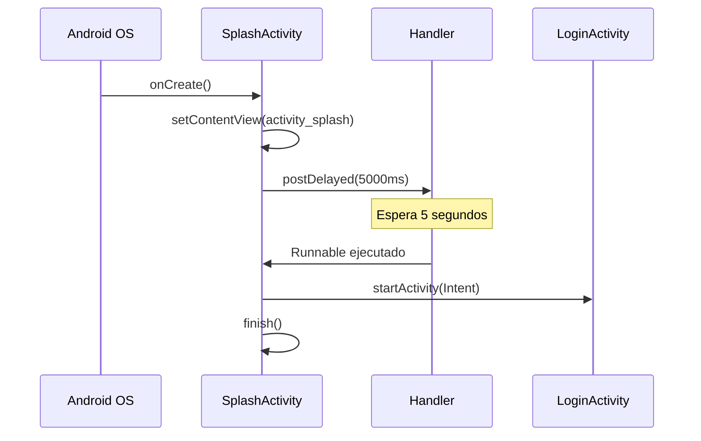
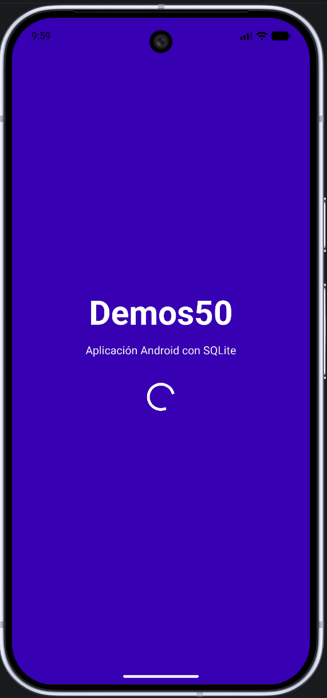
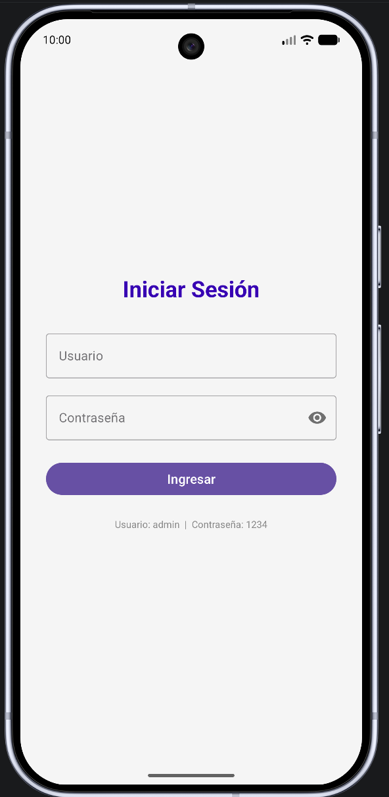
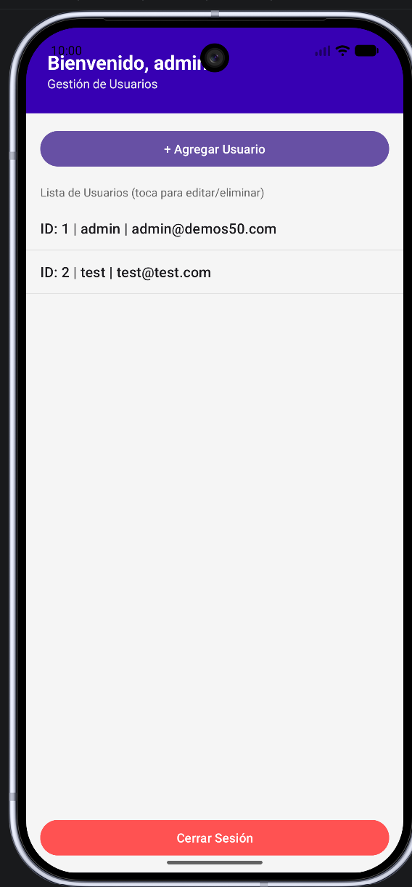
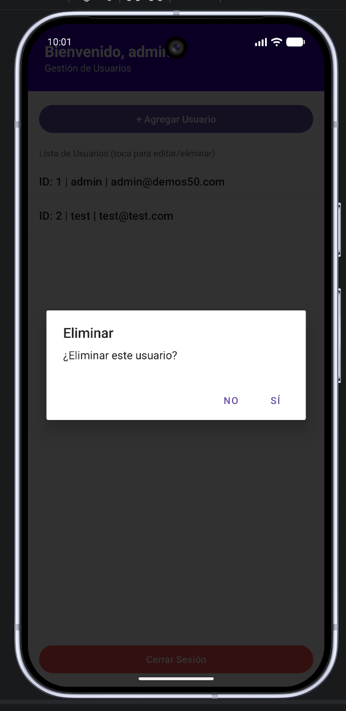
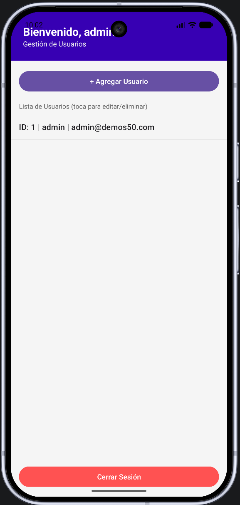

# 📱 Demos50 — s20 | Android + SQLite

> Actividad S20: Aplicación Android en **Java** con tres actividades mínimas, autenticación y gestión de usuarios mediante SQLite.

---

## 🎯 Objetivo

Configurar un ambiente de desarrollo para dispositivos móviles mediante la codificación en Java para Android, implementando al menos tres actividades con persistencia de datos local.

---

## 🗺️ Flujo de navegación



---

## 🏗️ Diagrama de clases



---

## 🗄️ Base de datos SQLite



### Operaciones CRUD

| Operación | Método | Descripción |
|-----------|--------|-------------|
| **C**reate | `insertUser(username, password, email)` | Agrega un nuevo usuario |
| **R**ead | `checkLogin(user, pass)` | Verifica credenciales en login |
| **R**ead | `getAllUsers()` | Retorna Cursor con todos los registros |
| **U**pdate | `updateUser(id, username, password, email)` | Modifica un registro existente |
| **D**elete | `deleteUser(id)` | Elimina usuario por ID |

---

## ⏱️ Ciclo de vida — SplashActivity



---

## 📁 Estructura

```
app/src/main/java/com/example/demos50/
├── SplashActivity.java      # Activity 1 — pantalla de carga
├── LoginActivity.java       # Activity 2 — autenticación
├── UserMenuActivity.java    # Activity 3 — gestión de usuarios
└── DatabaseHelper.java      # Helper SQLite con CRUD completo

app/src/main/res/layout/
├── activity_splash.xml
├── activity_login.xml
├── activity_user_menu.xml
└── dialog_user.xml
```

---

## ▶️ Credenciales por defecto

```
Usuario:    admin
Contraseña: 1234
```

---

## 📸 Capturas

| Splash | Login | CRUD |
|--------|-------|------|
|  |  |  |

| Eliminar | Actualizar |
|----------|-----------|
|  |  |

---

## 📋 Rúbrica

| Criterios | Excelente | Bueno | Deficiente | Pts |
| :--- | :--- | :--- | :--- | :--- |
| **Producto software** | CRUD con SQLite, navegación y persistencia completa | 60% completado o CRUD incompleto | 20% o menos | 40 |
| **Construcción de BD** | SQLite con librerías y objetos correctos | BD incompleta o librerías faltantes | Entrega parcial | 30 |
| **Puntualidad** | Entrega puntual y correcta | Puntual con errores de formato | Fuera del tiempo pactado | 30 |
| **Total** | | | | **100** |

> 📖 [Guía APA Sexta Edición](https://www.um.es/documents/378246/2964900/Normas+APA+Sexta+Edici%C3%B3n.pdf/27f8511d-95b6-4096-8d3e-f8492f61c6dc)
