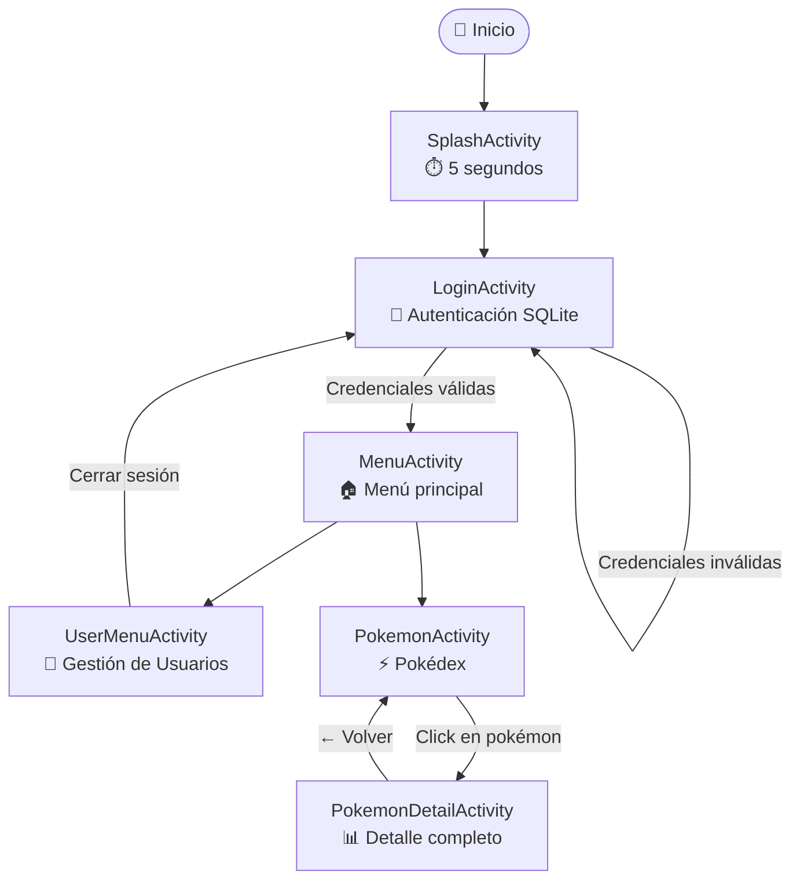
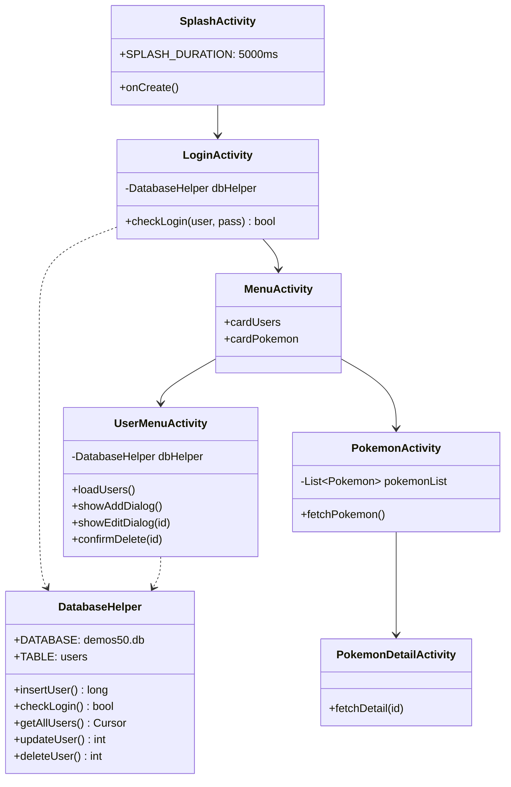
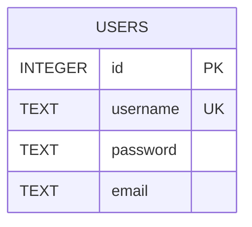
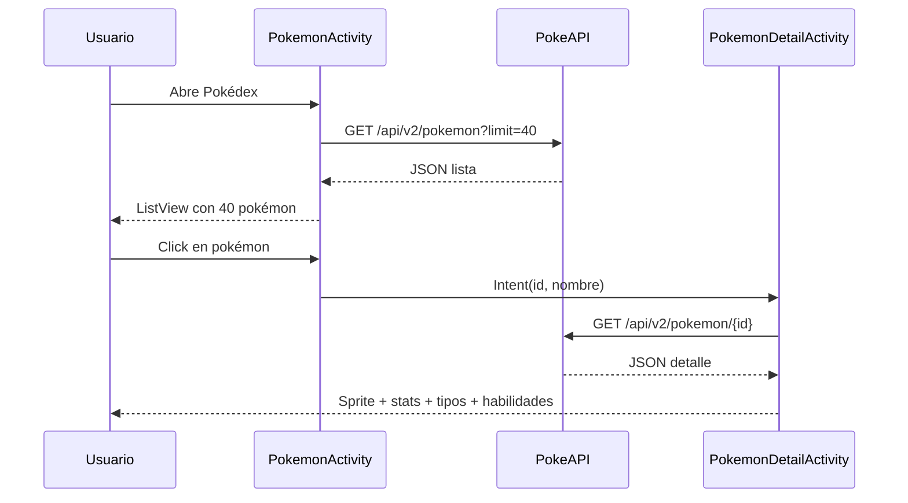
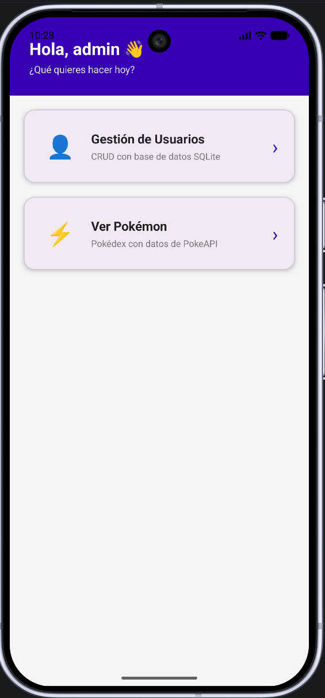
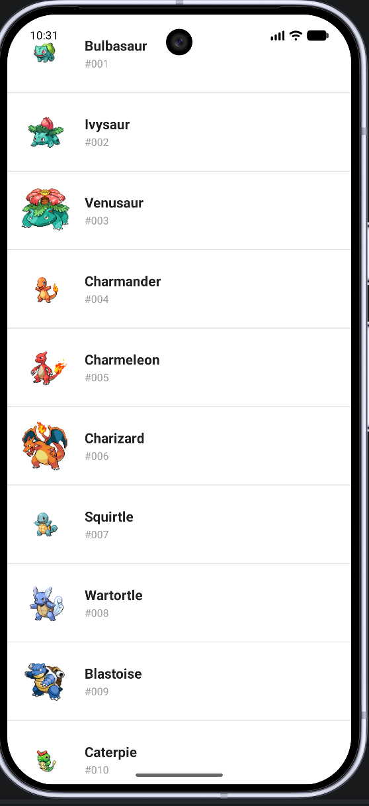
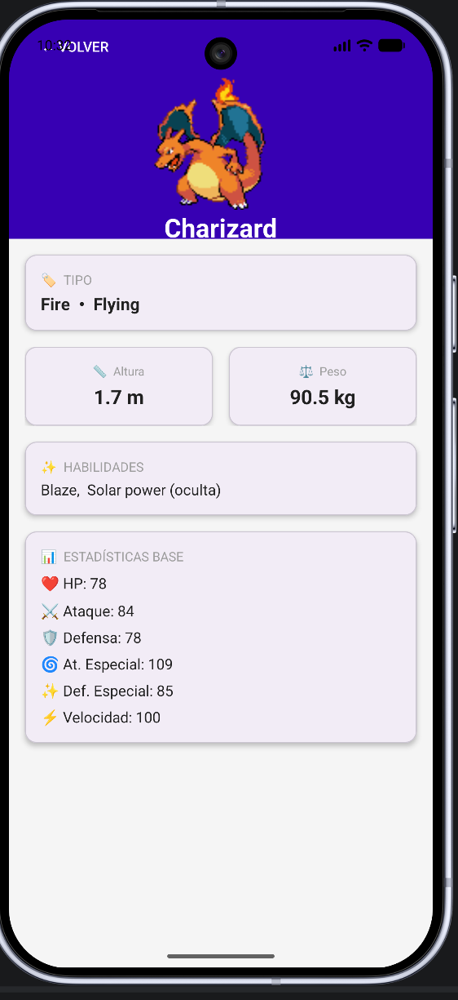

# 📱 Demos50 — Aplicación Android con SQLite y PokeAPI

> Proyecto académico desarrollado en **Java para Android** que implementa autenticación, gestión de usuarios con SQLite y consumo de API REST.

---

## 🎯 Objetivo

Configurar un ambiente de desarrollo para dispositivos móviles mediante la codificación en Java para Android, implementando navegación entre actividades, persistencia de datos con SQLite y consumo de servicios web externos.

---

## 🗺️ Flujo de navegación



---

## 🏗️ Arquitectura de actividades



---

## 🗄️ Esquema de base de datos SQLite



| Operación | Método | Descripción |
|-----------|--------|-------------|
| Create | `insertUser(username, password, email)` | Registro de nuevo usuario |
| Read | `getAllUsers()` / `checkLogin()` | Listado y autenticación |
| Update | `updateUser(id, username, password, email)` | Edición de datos |
| Delete | `deleteUser(id)` | Eliminación con confirmación |

---

## 🌐 Integración PokeAPI



| Endpoint | Uso |
|----------|-----|
| `GET /api/v2/pokemon?limit=40` | Lista paginada |
| `GET /api/v2/pokemon/{id}` | Detalle por ID |
| `sprites/pokemon/{id}.png` | Sprite estático |
| `sprites/.../animated/front_default` | Sprite animado gen-V |

---

## 📁 Estructura del proyecto

```
app/src/main/java/com/example/demos50/
├── SplashActivity.java
├── LoginActivity.java
├── MenuActivity.java
├── UserMenuActivity.java
├── DatabaseHelper.java
├── PokemonActivity.java
├── PokemonDetailActivity.java
├── PokemonAdapter.java
└── Pokemon.java
```

---

## 🛠️ Stack tecnológico

| Tecnología | Versión | Uso |
|------------|---------|-----|
| Java | 11 | Lenguaje principal |
| Android SDK | 36 | Target platform |
| SQLite | built-in | Persistencia local |
| Glide | 4.16.0 | Carga de imágenes |
| PokeAPI | v2 | Datos de pokémon |
| Material 3 | 1.10.0 | Componentes UI |

---

## ▶️ Cómo ejecutar

1. Clonar el repositorio
2. Abrir en **Android Studio**
3. Sincronizar Gradle
4. Ejecutar en emulador o dispositivo (minSdk 24)
5. Credenciales por defecto: `admin` / `1234`

---

## 📸 Capturas

| Splash | Login | Menú |
|--------|-------|------|
|  |  |  |

| CRUD Usuarios | Pokédex | Card |
|---------------|---------|------|
|  |  |  |

---

## 📋 Rúbrica

| Criterios | Excelente | Bueno | Deficiente | Pts |
| :--- | :--- | :--- | :--- | :--- |
| **Producto software** | CRUD completo, navegación y persistencia | 60% o CRUD incompleto | 20% o menos | 40 |
| **Construcción de BD** | SQLite con librerías y objetos correctos | BD incompleta | Entrega parcial | 30 |
| **Puntualidad** | Entrega puntual y correcta | Puntual con errores | Fuera de tiempo | 30 |
| **Total** | | | | **100** |

> 📖 [Guía APA Sexta Edición](https://www.um.es/documents/378246/2964900/Normas+APA+Sexta+Edici%C3%B3n.pdf/27f8511d-95b6-4096-8d3e-f8492f61c6dc)
